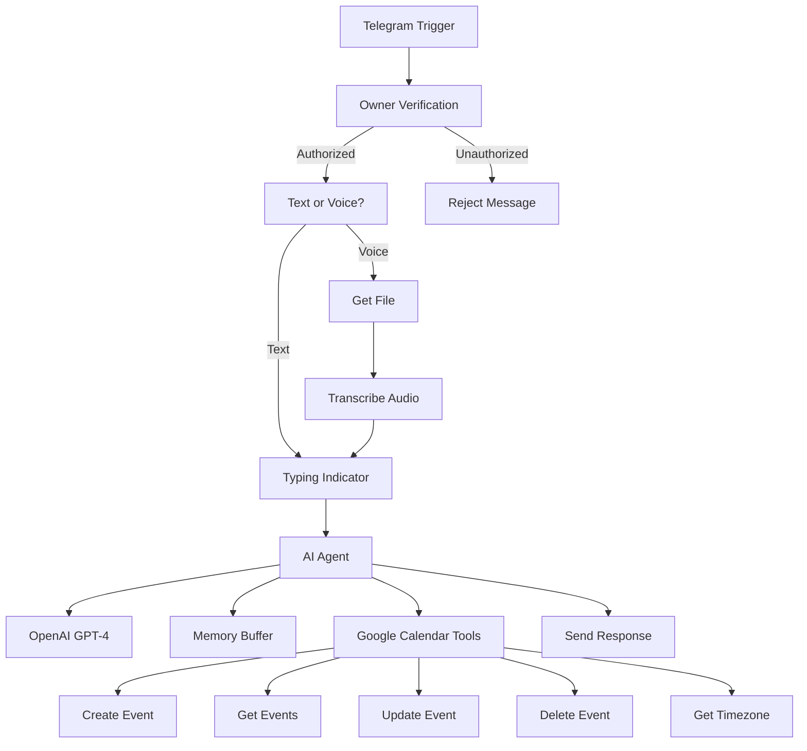

# 🤖 AI Calendar Assistant for Telegram

[](https://n8n.io)
[](https://opensource.org/licenses/MIT)
[](https://telegram.org/)

**[English](README.md)** | [Русский](README.ru.md)

---

Smart AI assistant for managing Google Calendar via Telegram with voice message support and natural language processing powered by **n8n** and **OpenAI GPT-4**.

### 📋 Description

A fully-featured n8n workflow that transforms a Telegram bot into an intelligent assistant for managing your Google Calendar. The bot understands natural language commands, recognizes voice messages, and can perform all basic calendar event operations.

### ✨ Features

- 📅 **Create Events** - "Create a meeting tomorrow at 3 PM"
- 🔍 **Search Events** - "What do I have this week?"
- ✏️ **Edit Events** - "Move meeting with John to 4 PM"
- 🗑️ **Delete Events** - "Delete Monday's meeting"
- 🎤 **Voice Input** - Send voice messages instead of text
- 🧠 **Context Memory** - Bot remembers last 10 messages
- 🌍 **Smart Time Detection** - Automatically detects timezone
- 🔒 **Access Control** - Owner-only access

### 🛠️ Tech Stack

- **n8n** - Workflow automation platform
- **OpenAI GPT-4.1-mini** - Natural language processing
- **OpenAI Whisper** - Voice recognition
- **Google Calendar API** - Event management
- **Telegram Bot API** - User interface

### 📦 Project Structure

```
google-calendar-ai-tg-assistant/
├── 💀 - Google Calendar + TG + AI assistant v2.json  # n8n workflow
├── README.md                                          # Documentation (EN)
├── README.ru.md                                       # Documentation (RU)
├── SETUP.md                                           # Setup instructions
├── LICENSE                                            # MIT License
├── .gitignore                                         # Ignored files
└── docs/                                              # Additional documentation
    ├── architecture.md                                # Workflow architecture
    └── screenshots/                                   # Interface screenshots
```

### 🚀 Quick Start

#### Requirements

- [n8n](https://n8n.io/) (self-hosted or cloud)
- [Telegram Bot Token](https://core.telegram.org/bots#creating-a-new-bot)
- [OpenAI API Key](https://platform.openai.com/api-keys)
- [Google Calendar OAuth2 credentials](https://developers.google.com/calendar/api/quickstart)

#### Installation

1. **Clone the repository:**
   ```bash
   git clone https://github.com/yourusername/google-calendar-ai-tg-assistant.git
   cd google-calendar-ai-tg-assistant
   ```

2. **Import workflow into n8n:**
   - Open n8n
   - Click "Import from File"
   - Select `💀 - Google Calendar + TG + AI assistant v2.json`

3. **Configure credentials:**
   - Telegram Bot API
   - OpenAI API
   - Google Calendar OAuth2

4. **Set your Owner ID:**
   - Get your Telegram ID (e.g., via @userinfobot)
   - Replace `331119294` with your ID in nodes:
     - "Owner Verification"
     - "Simple Memory" (sessionKey)
     - "Error Notification" (chatId)

5. **Activate workflow:**
   - Click "Active" in the top right corner

Detailed instructions: [SETUP.md](SETUP.md)

### 💬 Usage Examples

**Text Commands:**
```
👤 User: Create a meeting with Anna tomorrow at 2 PM
🤖 Bot: ✅ Created event "Meeting with Anna" for tomorrow at 2 PM

👤 User: What do I have next week?
🤖 Bot: 🔍 Found 3 events for next week:
       1. Team Meeting - Monday, 3:00 PM
       2. Client Call - Wednesday, 10:30 AM
       3. Birthday - Friday, All day
```

**Voice Messages:**
```
🎤 "Move the meeting with Andrew to three PM"
🤖 ✅ Updated event "Meeting with Andrew" to 3:00 PM
```

### 🏗️ Workflow Architecture



### 🔧 Workflow Components

| Node | Purpose |
|------|---------|
| **Telegram Trigger** | Receives incoming messages |
| **Owner Verification** | Checks user ID |
| **Text or Voice?** | Determines message type |
| **Get a file** | Downloads voice message |
| **Transcribe a recording** | Converts speech to text (Whisper) |
| **Typing Indicator** | Shows "typing..." status |
| **Calendar AI Agent** | Processes requests via GPT-4 |
| **OpenAI Chat Model** | GPT-4.1-mini language model |
| **Simple Memory** | Stores dialog context (10 messages) |
| **Create an event** | Creates calendar events |
| **Get many events** | Retrieves event list |
| **Update an event** | Updates existing events |
| **Delete an event** | Deletes events |
| **HTTP Request** | Gets user timezone |
| **Send a text message** | Sends response to Telegram |
| **Error Trigger** | Catches errors |
| **Error Notification** | Sends error notifications |

### 🔒 Security

- ✅ Owner-only access (Telegram ID verification)
- ✅ Unauthorized users receive rejection message
- ✅ Sensitive data (tokens, keys) stored in n8n credentials
- ✅ `.gitignore` excludes confidential information from repository

### 📊 System Requirements

- **n8n**: version 1.0+
- **Node.js**: 18.x or higher (for self-hosted)
- **RAM**: minimum 512 MB
- **Disk**: ~100 MB for workflow

### 🐛 Known Limitations

- Maximum 10 messages in memory context
- Voice messages: up to 20 MB
- Recognition only in Russian and English
- API rate limits (OpenAI, Telegram, Google Calendar)

### 🤝 Contributing

Contributions are welcome! Please:

1. Fork the project
2. Create a feature branch (`git checkout -b feature/AmazingFeature`)
3. Commit your changes (`git commit -m 'Add AmazingFeature'`)
4. Push to the branch (`git push origin feature/AmazingFeature`)
5. Open a Pull Request

### 📝 Changelog

**v2.0.0** (2025-01-01)
- Added voice message support
- Improved natural language processing
- Added context memory (10 messages)
- Automatic timezone detection
- Enhanced error handling

### 📄 License

MIT License - see [LICENSE](LICENSE)

### 👨‍💻 Author

Created with ❤️ for calendar automation

### 🙏 Acknowledgments

- [n8n.io](https://n8n.io/) - for the amazing automation platform
- [OpenAI](https://openai.com/) - for GPT-4 and Whisper
- [Telegram](https://telegram.org/) - for Bot API

---

### 📞 Support

If you have questions or need help:
- 📧 Open an issue on GitHub
- 💬 Contact: [@khanalytiq](https://t.me/khanalytiq)

**⭐ If you find this project useful, please give it a star!**
